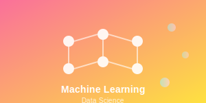

# Blog Image Placeholders

This folder contains custom SVG placeholder images for the GlobeAI blog. All images are lightweight, responsive, and designed to match the AI/technology theme of the website.

## Image Files

### Featured Images (500x300)
- `featured-ai-technology.svg` - Main featured post image with neural network visualization
- `blog-post-hero.svg` - Large hero image for individual blog posts (800x400)

### Category Images (400x200)
- `ai-technology.svg` - General AI technology with neural network nodes
- `ai-healthcare.svg` - Medical AI with DNA helix and brain scan elements
- `machine-learning.svg` - ML algorithms with data clusters and decision trees
- `ai-powered-tools.svg` - Productivity tools with circuit board patterns
- `generative-ai.svg` - Creative AI with paintbrush, palette, and canvas
- `technology-news.svg` - News updates with trending graphs and signal waves
- `latest-ai-updates.svg` - Version updates with progress bars and timelines

### Related Post Images (300x150)
- `related-post-1.svg` - Machine learning focused design
- `related-post-2.svg` - Healthcare AI focused design

## Design Features

### Visual Elements
- **Neural Networks** - Connected nodes representing AI processing
- **Data Visualization** - Graphs, charts, and data points
- **Technology Icons** - Tools, gears, and circuit patterns
- **Medical Elements** - DNA helixes, brain scans, medical crosses
- **Creative Elements** - Paintbrushes, palettes, and artistic flows

### Color Schemes
- **Primary Gradients** - Purple to blue, pink to yellow, blue to cyan
- **Accent Colors** - White, light pastels, and complementary hues
- **Opacity Levels** - Multiple layers for depth and visual interest

### Typography
- **Category Labels** - Bold, clear text for easy identification
- **Descriptive Text** - Subtle secondary text for context
- **Font Family** - Arial for consistency across platforms

## Usage

### In HTML Files
```html
<!-- Featured post -->


<!-- Category posts -->


<!-- Related posts -->

```

### Benefits
1. **Fast Loading** - SVG files are lightweight and scale perfectly
2. **No External Dependencies** - No reliance on external image services
3. **Consistent Branding** - All images follow the same design language
4. **Responsive** - Automatically scale to any screen size
5. **Customizable** - Easy to modify colors, sizes, and elements
6. **Professional** - Clean, modern design that matches the site theme

## Customization

### Changing Colors
Edit the gradient definitions in each SVG file:
```svg
<linearGradient id="grad1" x1="0%" y1="0%" x2="100%" y2="100%">
  <stop offset="0%" style="stop-color:#667eea;stop-opacity:1" />
  <stop offset="100%" style="stop-color:#764ba2;stop-opacity:1" />
</linearGradient>
```

### Adding New Categories
1. Create a new SVG file with appropriate dimensions
2. Use consistent design elements and color schemes
3. Include category-specific visual elements
4. Add descriptive text labels
5. Update this README with the new image details

### Modifying Existing Images
- All images use semantic IDs for easy identification
- Gradient definitions are reusable across elements
- Text elements can be easily updated
- Visual elements are grouped logically

## File Sizes
- Featured images: ~4KB each
- Category images: ~2.5-3.5KB each
- Related post images: ~2.2-2.4KB each
- Total folder size: ~35KB

All images are optimized for web use and maintain high quality at any scale. 